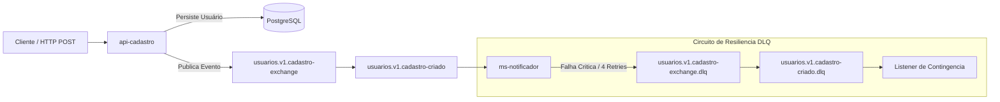

# Sistema de Cadastro e Notificações (Arquitetura Orientada a Eventos com RabbitMQ)

Este repositório apresenta um ecossistema de microsserviços modular, resiliente e totalmente conteinerizado, focado no fluxo de cadastro de usuários e disparos de notificações assíncronas. O projeto aplica padrões arquiteturais de alta disponibilidade e tolerância a falhas, simulando cenários reais de engenharia de software de nível sênior.

## 🏗️ Arquitetura do Sistema

O ecossistema é composto por dois microsserviços principais que se comunicam de forma assíncrona através do broker de mensageria **RabbitMQ**, utilizando o banco de dados **PostgreSQL** para persistência e **Docker** para a orquestração da infraestrutura.

---
### 🔙 Voltar ao meu perfil principal
Clique [aqui](https://github.com/gabrielfguimar) para ver meu portfólio completo, projetos e jornada técnica.
